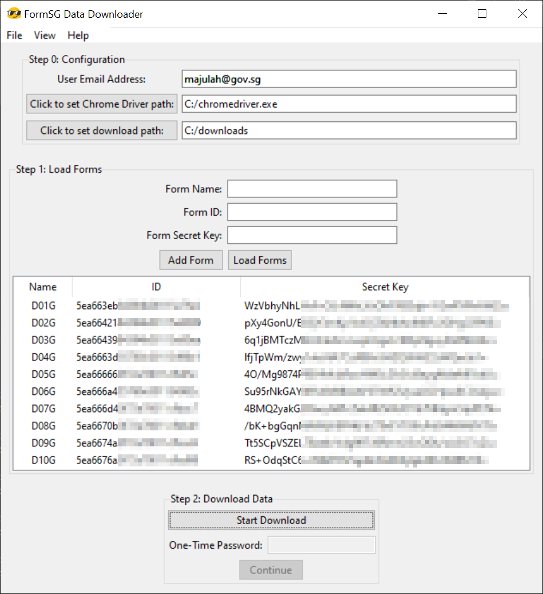

# FormSG Downloader
A simple GUI for downloading data from FormSG forms created using the
"storage" mode:



# Installation (Option 1) - Using Pre-Built Binaries

Visit the "Releases" tab, and download the latest binary. Double-click on
the binary to start the program.

# Installation (Option 2) - Using Python

1. Ensure Python 3.8 and pip are installed on your system.
1. In a shell terminal, run the following:
    ```shell
    $ python -m pip install git+https://github.com/YongJieYongJie/form-sg-downloader.git
    ```
1. In a shell terminal, run the following:
    ```shell
    $ python -m formsgdownloader.gui
    ```

# Quick Start

After the GUI starts, click on the "Help" menu. Follow the instructions
there.

# Impetus

This GUI was inspired by the frustration faced when administering numerous forms
for the capturing and reporting of Covid-19 data.

# Buliding binary on Windows

Run the following command:

```shell
$ pyinstaller --noconfirm --onefile --windowed --icon "./formsgdownloader/favicon.ico" --add-data "./formsgdownloader/favicon.ico;."  "./formsgdownloader/gui.py"
```
